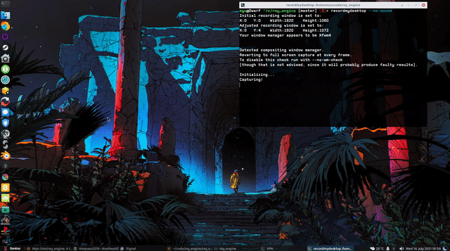

## ray_engine

#### A toy raycasting engine built with Go + Ebiten v2 2D library

Heavily based on 3DSage fantastic Youtube videos of a C/OpenGL raycasting engine : https://www.youtube.com/watch?v=gYRrGTC7GtA

_2D map rendered in 3D_

_Gun mode !_

 

#### Build & run

Build with Go 1.16 and Ebiten v2 on Linux

     go build
    ./ray_engine

#### Shortcuts

arrows : move

'i' : debug info toogle

'f' : fullscreen toogle

','' : No 2D map, "gun mode"

'k' : quit

#### Todo

- [X] Port to Ebiten v2
- [ ] Proper Collisions
- [X] Scale map to 16x16
- [X] 2D minimap for gun mode
- [X] Add basic floor/ceiling
- [ ] Binary textures
- [ ] Up/down parallax/Y-Shearing
- [ ] Proper sound support
- [ ] Weapon swap/shield

#### Known bugs

- [ ] Mouse support is very dodgy (blocks keyboard left/right movements)
- [ ] "scaling issue" -> cubes becomes rectangles from afar
