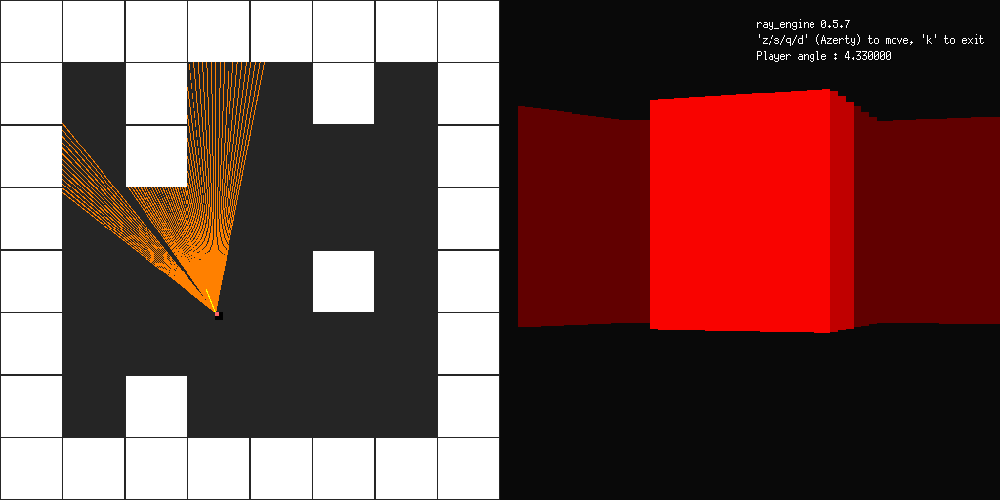

## ray_engine

A toy raycasting engine built with Go + Ebiten (v1) 2D library

Heavily based on 3DSage fantastic youtube video of a C/OpenGL raycasting engine : https://www.youtube.com/watch?v=gYRrGTC7GtA

#### Build

    go build

#### Run

    ./ray_engine

#### The code is ugly af

    I know right, PR's are welcome :p
