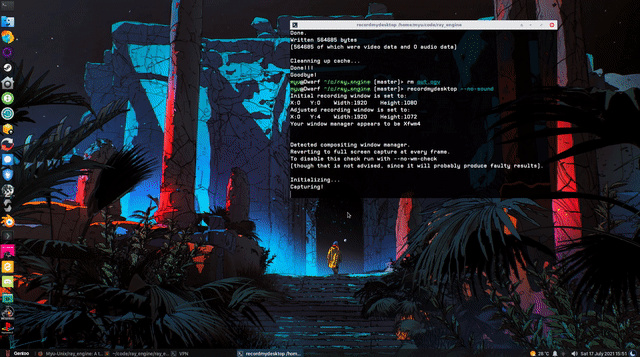
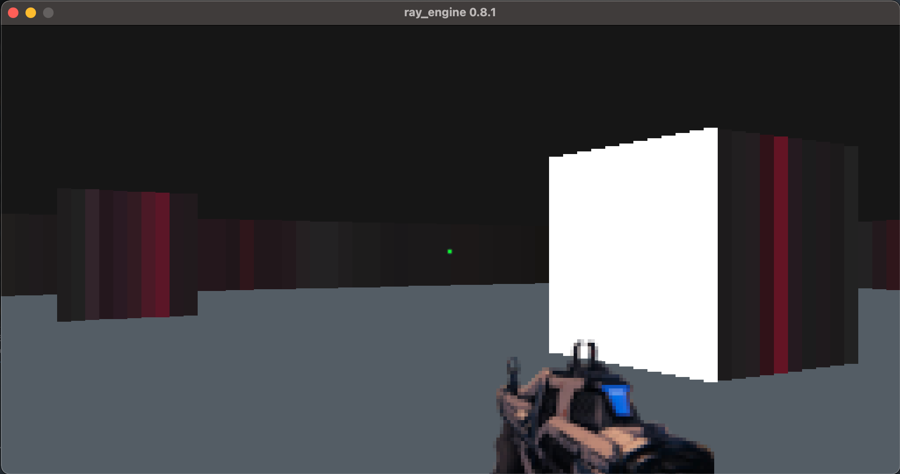

## ray_engine

#### A toy raycasting engine built with Go + Ebiten v2 2D library

Heavily based on [3DSage fantastic Youtube videos of a C/OpenGL raycasting engine](https://www.youtube.com/watch?v=gYRrGTC7GtA)

_Gun mode !_

 

_2D map rendered in 3D_

#### Build & run

Build with Go 1.16 and Ebiten v2 on Linux

     go build
    ./ray_engine

#### Keymaps

Arrows keys or ZSQD (Azerty) : Move

'i' : debug info toogle

'f' : fullscreen toogle

'm' : Gun mode

'k' : quit

#### Features, todos and idea box

- [X] Port to Ebiten v2
- [ ] Proper collisions
- [X] Scale map to 16x16
- [X] 2D minimap for gun mode
- [X] Add basic floor/ceiling - **Just a matching png for now**
- [ ] Binary textures
- [ ] Up/down parallax/Y-xhearing
- [ ] Ebiten Audio mp3 sound support
- [ ] Weapon swap/shield
- [ ] Proper ballistics - **Rough prototype**
- [ ] Cube destruction/basic enemies - **Rough prototype**
- [X] Rebuild the 2D map (where actual raycasting is done) to fit the screen

#### Known bugs

- [ ] Mouse support is very dodgy (blocks keyboard left/right movements)
- [ ] "scaling issue" -> cubes becomes rectangles from afar
- [ ] Enemies are seen through walls

#### Assets

Gun from Destiny 2 by Bungie
Scanlines from https://raw.githubusercontent.com/ArcadeAtHomeUK/ArcadeAtHomeUK.github.io/master/Scanlines/1600x1200/Scanlines%20100%25.png