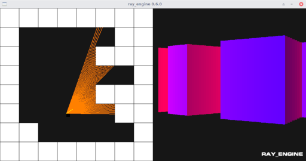

## ray_engine

### A toy raycasting engine built with Go + Ebiten (v1) 2D library

 

Heavily based on 3DSage fantastic Youtube videos of a C/OpenGL raycasting engine : https://www.youtube.com/watch?v=gYRrGTC7GtA

#### Build

    go build

#### Run

    ./ray_engine

#### Shortcuts

arrows : move

'i' : debug info toogle

'f' : fullscreen toogle

','' : No 2D map, "gun mode"

'k' : quit

#### Todo

- [ ] Port to Ebiten v2
- [ ] Scale map to 32x32+
- [ ] Scale viewport/window to 1080p
- [ ] Make a 2D minimap
- [ ] Add floor/ceiling
- [ ] Binary textures
- [ ] Up/down parallax
- [ ] Better mouse + keyboard support